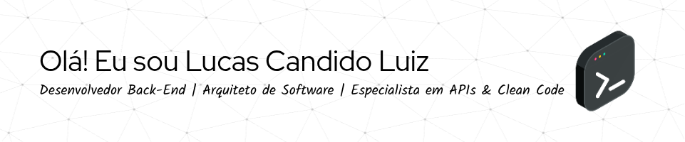
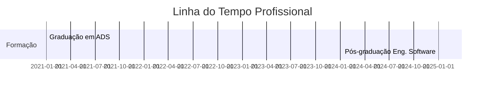

<p align="center">
  
</p>

---

## 🧠 Sobre Mim

Sou um desenvolvedor back-end apaixonado por tecnologia, qualidade de código e performance. 
Tenho experiência em arquitetar sistemas escaláveis com boas práticas como:

- 🧼 Clean Code & SOLID
- 🧪 TDD (Test Driven Development)
- 🧹 DDD (Domain Driven Design)
- 🔄 Integrações CI/CD

> "Transformar desafios técnicos em soluções limpas e elegantes é minha paixão."

---

## 📚 Formação Acadêmica

<p align="center">
  
  
</p>

---

## 🧰 Tecnologias & Ferramentas

<div align="center">

### 💻 Linguagens de Programação


### 🚀 Frameworks & Runtimes


### 📔️ Bancos de Dados


### 🔧 DevOps & Ferramentas


</div>

---

## 📊 GitHub Insights

<div align="center">
  
  
  
</div>

---

## 📂 Linha do Tempo



---

## 🧹 Stack YAML

```yaml
backend:
  linguagens:
    - Java
    - Python
    - JavaScript
    - C
    - C++
    - C#
  frameworks:
    - Spring Boot
    - Node.js
  bancos:
    - MySQL
    - SQLite
  praticas:
    - Clean Code
    - TDD
    - DDD
    - CI/CD
```

---

## 📢 Contato

<div align="center">
  <a href="https://www.linkedin.com/in/lucascandidoluiz/" target="_blank"></a> <a href="mailto:luizcandidolucas@hotmail.com" target="_blank"></a> <a href="https://linktr.ee/boltreskh" target="_blank"></a>
</div>

---

<p align="center">
  <strong>"Código limpo não é um objetivo, é um estilo de vida."</strong>
</p>